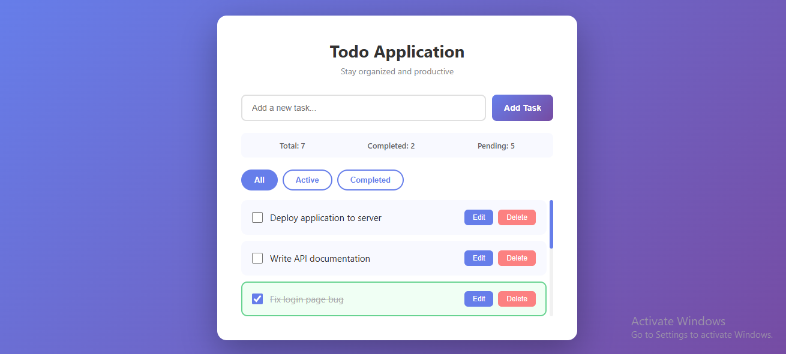
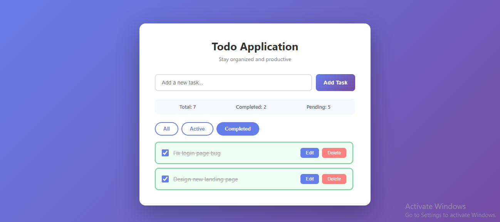

# Todo Application

A full-stack Todo Application built with React.js, Node.js, Express.js, and PostgreSQL.

## Features

- Add new tasks
- Edit existing tasks
- Delete tasks with confirmation
- Mark tasks as complete/incomplete
- Filter tasks by All, Active, and Completed
- Task statistics (Total, Completed, Pending)
- Scrollable task list
- Responsive design
- Data persists in PostgreSQL database

## Tech Stack

**Frontend:** React.js, CSS3

**Backend:** Node.js, Express.js

**Database:** PostgreSQL

## Project Structure

    Todo Application/
    ├── client/
    │   ├── src/
    │   │   ├── components/
    │   │   │   └── TodoApp.js
    │   │   ├── App.js
    │   │   └── App.css
    │   └── package.json
    ├── server/
    │   ├── config/
    │   │   └── db.js
    │   ├── index.js
    │   └── package.json
    └── README.md

## Setup Instructions

### Prerequisites
- Node.js installed
- PostgreSQL installed

### 1. Clone the repository

    git clone https://github.com/nilisha29/Todo-Application.git
    cd Todo-Application

### 2. Setup Database

Open PostgreSQL and run:

    CREATE DATABASE todoapplication;
    \c todoapplication
    CREATE TABLE todos (
      id SERIAL PRIMARY KEY,
      title VARCHAR(255) NOT NULL,
      completed BOOLEAN DEFAULT false,
      created_at TIMESTAMP DEFAULT CURRENT_TIMESTAMP
    );

### 3. Setup Backend

    cd server
    npm install

Create a .env file inside server folder:

    PORT=5000
    DB_USER=postgres
    DB_PASSWORD=yourpassword
    DB_HOST=localhost
    DB_PORT=5432
    DB_NAME=todoapplication

Then run:

    npm run dev

Server runs on http://localhost:5000

### 4. Setup Frontend

    cd client
    npm install
    npm start

App runs on http://localhost:3000

## API Endpoints

| Method | Endpoint | Description |
|--------|----------|-------------|
| GET | /todos | Get all todos |
| POST | /todos | Create a new todo |
| PUT | /todos/:id | Update a todo |
| DELETE | /todos/:id | Delete a todo |

## Screenshots

## Developed By

Nilisha Khadgi